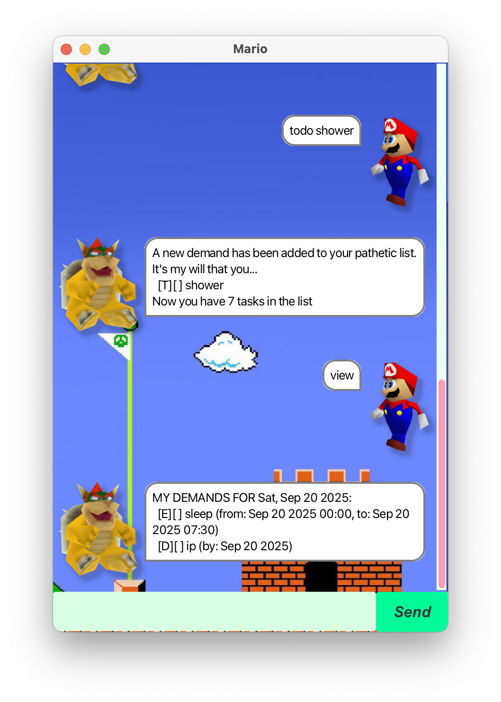

# Mario User Guide


> *"Gwahaha! It’s me, Bowser — your sassy, witty, and  mean overlord.  
> I’m here to keep your tasks in line and laugh while you struggle to keep up."*  
> — **Bowser**

Built with **JavaFX**, Mario chatbot helps you keep track of deadlines, events, and to-dos with a playful twist.

---

## Quick Start
1. Ensure you have Java ```17``` or above installed on your computer.  
   ***Mac users***: Ensure you have the precise JDK version prescribed here.*
2. Download the latest `.jar` file from [here](https://github.com/binghangc/ip/releases).
3. Copy the file to the folder you want to use as the home folder for your application.
4. Open a command terminal, `cd` into the folder you put the `.jar` file in, and run `java -jar addressbook.jar`.
5. A GUI similar to the below should appear in a few seconds.

---
## Features
- [Add ToDos `todo`](#add-todos-todo)
- [Add Deadlines `deadline`](#add-deadlines-deadline)
- [Add Events `event`](#add-events-event)
- [Delete Tasks `delete`](#delete-tasks-delete)
- [Find Tasks `find`](#find-tasks-find)
- [Mark Tasks `mark`/`unmark`](#mark-tasks-markunmark)
- [List Tasks `list`](#list-tasks-list)
- [View Schedule `view`](#view-schedule-view)

### Add ToDos: `todo`
Use the `todo` command to add a simple task without deadlines or timings.  

**Format:**  
```
todo DESCRIPTION
```

### Add Deadlines: `deadline`
Use the `deadline` command to add a task with a due date.  

**Format:**  
```
deadline DESCRIPTION /by YYYY-MM-DD
```
> 💡 **Tip:** Deadlines only require a date. If you need a start and end time, use an `event` instead.

### Add Events: `event`
Use the `event` command to add a task that has a start and end time.  

**Format:**  
```
event DESCRIPTION /from YYYY-MM-DD HH:mm /to YYYY-MM-DD HH:mm
```
### List Tasks: `list`
Use the `list` command to display all your current tasks.

**Format:**
```
list
```
> 💡 **Tip:** Use the task number from your list to perform task deletion or mark tasks

### Delete Tasks: `delete`
Use the `delete` command to remove a task from your list.  

**Format:**  
```
delete TASK_NUMBER
```


### Find Tasks: `find`
Use the `find` command to search for tasks containing a keyword.  

**Format:**  
```
find KEYWORD
```


### Mark Tasks: `mark`/`unmark`
Use the `mark`/`unmark` command to mark a task as completed/incomplete.  

**Format:**  
```
mark TASK_NUMBER
unmark TASK_NUMBER
```


### View Schedule: `view`
Use the `view` command to see your schedule for a specific date.  

**Format:**  
```
view YYYY-MM-DD
```

> 💡 **Tip:** If you don’t provide a date, the schedule shown will default to the current day.

---
## Command Summary

| Action          | Format / Example                                    |
|-----------------|-----------------------------------------------------|
| **Add ToDo**    | `todo DESCRIPTION` <br> e.g., `todo buy groceries` |
| **Add Deadline**| `deadline DESCRIPTION /by YYYY-MM-DD` <br> e.g., `deadline submit report /by 2025-09-25` |
| **Add Event**   | `event DESCRIPTION /from YYYY-MM-DD HH:mm /to YYYY-MM-DD HH:mm` <br> e.g., `event meeting /from 2025-09-25 14:00 /to 2025-09-25 15:00` |
| **List**        | `list` |
| **Delete**      | `delete TASK_NUMBER` <br> e.g., `delete 2` |
| **Find**        | `find KEYWORD` <br> e.g., `find groceries` |
| **Mark**        | `mark TASK_NUMBER` <br> e.g., `mark 1` |
| **Unmark**      | `unmark TASK_NUMBER` <br> e.g., `unmark 1` |
| **View Schedule** | `view YYYY-MM-DD` <br> e.g., `view 2025-09-25` |
| **Exit**        | `bye` |